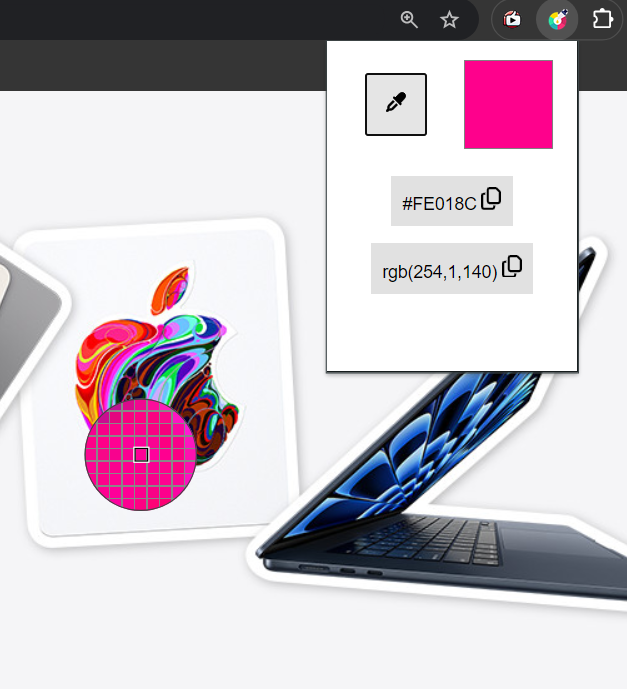

# Eyedropper Extension


**Get your favorite colors from any website by one click!**

## Overview 



Eyedropper extension is a simple tool for chrome that allows you to get color codes from any page you like and copy color code to clipboard

## Get Started

1. clone this repo

```
git clone https://github.com/alwaleedibrahim/eyedropper-extension.git
```

2. Open chrome browser, go to Extensions > Manage Extensions

3. Enable Developer mode from the top right corner if it's not enabled already

4. Select load unpacked and choose eyedropper-extension/src folder

5. All set, Enjoy!

*Currently, Eydropper extension is not available on Chrome Web Store. Check this repo again for updates*

## Contributing

We welcome contributions to Eyedropper Extension! If you're interested in helping out, please read our [Contributing Guidelines](CONTRIBUTING.md) for details on our code of conduct and the process for submitting pull requests.